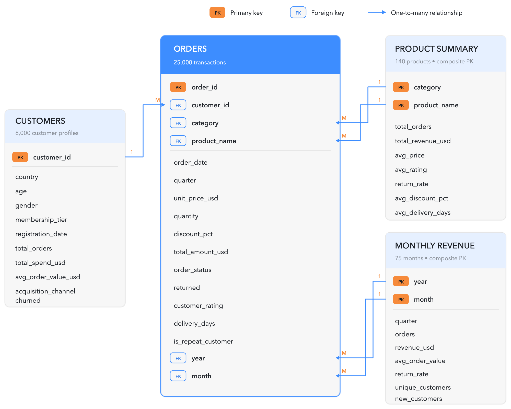
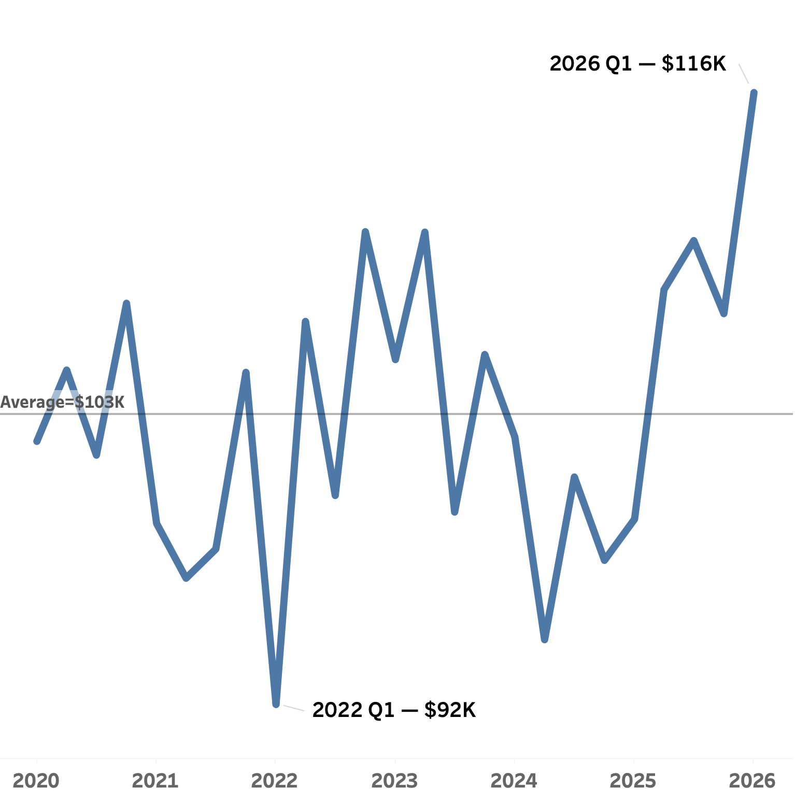
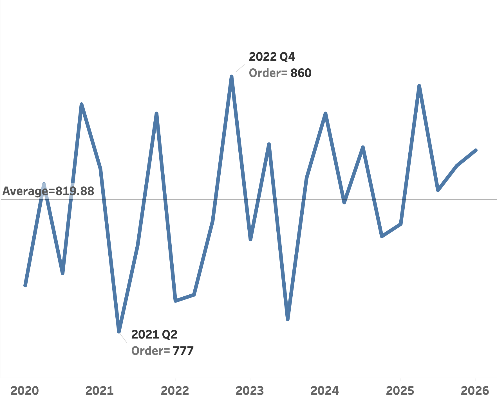

<h1 align="center">NexaCart Global E-commerce Performance Report</h1>

<table align="center">
  <tr>
    <td width="900">
      <h2 align="center">Client Background</h2>
      

        NexaCart Global is a multinational e-commerce company offering a diverse range of consumer products through its digital marketplace. Established in 2019, the company serves customers across <strong>20 countries</strong> and operates across <strong>14 product categories</strong>.
      

      

        The NexaCart database contains approximately <strong>25,000 customer orders</strong> and transaction activity covering <strong>2020 to Q1 2026</strong>, with total revenue of approximately <strong>$2.59 million</strong>. The available data is organised into four tables: <strong>orders, customers, product summary and monthly revenue</strong>. Together, these tables provide the measures and dimensions required to evaluate sales, customer behaviour, product performance, acquisition channels, customer tiers and geographic demand.
      

      

        To support its next phase of growth, NexaCart Global commissioned a comprehensive customer and sales performance analysis covering its years of operation from <strong>2020 to Q1 2026</strong>. Reporting to the <strong>Chief Commercial Officer</strong>, the analysis is designed to provide evidence-based insights that support better commercial decisions and improve operational performance. The key insights and recommendations focus on the following areas:
      

      <h3 align="left">Northstar Metrics</h3>
      <ul>
        <li><strong>Sales performance</strong> - Evaluate revenue trends, order volume, units sold and average order value across time and countries.</li>
        <li><strong>Product performance</strong> - Identify high-performing and underperforming products, understand their commercial impact and compare return rates across the years of operation.</li>
        <li><strong>Customer acquisition channel and customer tier</strong> - Evaluate acquisition channels and customer tiers to identify the most effective routes to market and support the NexaCart marketing team.</li>
        <li><strong>Country performance</strong> - Examine revenue, customer satisfaction and product demand across NexaCart's countries of operation to identify strong markets and improvement opportunities.</li>
      </ul>
    </td>
  </tr>
</table>

<h1 align="center">Executive Summary</h1>

<table align="center">
  <tr>
    <td width="900" align="center">
      <h3 align="center">Revenue Remained Volatile Across the Years and Peaked in Q1 2026</h3>
      
    </td>
  </tr>
</table>

 

<table align="center">
  <tr>
    <td width="900" align="center">
      <h3 align="center">Quarterly Revenue Variance from the $103.41K Benchmark</h3>
      
    </td>
  </tr>
</table>

 

<table align="center">
  <tr>
    <td width="450" valign="top">
      <ol>
        <li>
          <strong>Revenue Growth and Peak Performance</strong>
          <ul>
            <li>After revenue declined <strong>4.3% from $417.18K in 2020 to $399.25K in 2021</strong>, NexaCart returned to growth in 2022, when revenue increased <strong>2.7% to $409.93K</strong>.</li>
            <li>The strongest full-year result was recorded in <strong>2025</strong>: revenue reached <strong>$425.36K</strong>, representing <strong>7.5% year-on-year growth</strong> from 2024.</li>
            <li>Sales improves further in <strong>Q1 2026</strong>, when revenue peaked at a record of <strong>$116.15K</strong>—<strong>12.3% above</strong> the $103.41K quarterly benchmark and the highest quarter in the dataset.</li>
            <li>Because the 2026 data covers only Q1, this peak should be treated as a strong opening signal rather than evidence of full-year growth.</li>
          </ul>
        </li>
        <li>
          <strong>Growth Returned in 2023 Before a Broad-Based 2024 Downturn</strong>
          <ul>
            <li>Revenue increased <strong>2.8% to $421.59K in 2023</strong>, supported by Q1 and Q2 results that finished <strong>2.1% and 7.0% above</strong> the quarterly benchmark.</li>
            <li>The recovery was uneven: <strong>Q3 2023 fell 3.7% below</strong> the benchmark before Q4 recovered to <strong>2.3% above</strong> it.</li>
            <li>2024 experienced massive downturn below average sales with its annual revenue declined by<strong>6.2% to $395.66K</strong> and every quarter underperformed the benchmark: <strong>Q1 by 0.8%, Q2 by 8.6%, Q3 by 2.4% and Q4 by 5.6%</strong>.</li>
            <li>The below average performance in the four quarters in 2024 indicates a broad-based performance problem, rather than a single-quarter anomaly.</li>
          </ul>
        </li>
      </ol>
    </td>
    <td width="450" valign="top">
      <ol start="3">
        <li>
          <strong>Quarterly Insights &amp; Seasonal Trends</strong>
          <ul>
            <li>Q1 has a consistent below average performance: it finished below the benchmark in <strong>2020 (-1.0%), 2021 (-4.2%), 2022 (-11.1%) - lowest performing month, 2024 (-0.8%) and 2025 (-4.0%)</strong>. The major exceptions were <strong>Q1 2023 (+2.1%)</strong> and the record <strong>Q1 2026 (+12.3%)</strong>.</li>
            <li>Q4 every year has a strong sales performance above average with <strong>2020 (+4.3%), 2022 (+7.0%) and 2023 (+2.3%)</strong> above average; however, <strong>Q4 2024 has a dip of (-5.6%) below average</strong> which might be due to seasonality.</li>
            <li>Sales performance experienced sustained growth from <strong>Q2 2025</strong>: revenue remained above average in <strong>Q2 (+4.8%), Q3 (+6.7%) and Q4 (+3.9%)</strong>, and experiencing peak performance in <strong>Q1 2026 (+12.3%)</strong>.</li>
          </ul>
        </li>
        <li>
          <strong>Key Takeaways &amp; Recommendations</strong>
          <ul>
            <li><strong>Protect the recovery:</strong> identify the countries, products, customer tiers and channels driving the above-average <strong>Q2 2025–Q1 2026</strong> run, then focus inventory and marketing investment there.</li>
            <li><strong>Explain the 2024 decline:</strong> Investigate the cause of below average sales performance (i.e. Return rate, internal factors,  AOV, churn rate, competition etc) </li>
            <li><strong>Reproduce Performing Quarters Strategy:</strong> NexaCart should leverage on high performing quarters to refine marketing and sales strategies.</li>
            <li><strong>Forecast 2026 cautiously:</strong> update Q2–Q4 rolling forecasts and confirm whether the record <strong>$116.15K</strong> in Q1 reflects sustainable order growth.</li>
          </ul>
        </li>
      </ol>
    </td>
  </tr>
</table>

<h2 align="center">Dataset Structure and ERD (Entity Relationship Diagram)</h2>

  The NexaCart database contains <strong>33,215 rows</strong> across four tables. The <strong>orders</strong> table is the central transactional (fact) table: it connects to customers through <strong>customer_id</strong>, to product summary through the composite key <strong>category + product_name</strong>, and to monthly revenue through the composite key <strong>year + month</strong>. The tables connects with a cardinality of one to many which preserve order-level detail and time-based analysis.

  

<h1 align="center">Insights Deep-Dive</h1>

<h2 align="center">Sales Revenue</h2>

<table align="center">
  <tr>
    <td width="900" align="center">
      
    </td>
  </tr>
</table>

 

<table align="center">
  <tr>
    <td width="900" valign="top">
      <ol>
        <li>
          <strong>Peak Revenue in 2026 Q1 following a sustained recovery</strong>
          <ul>
            <li>Quarterly delivered revenue reached <strong>$116.15K</strong> in <strong>Q1 2026</strong>, the highest result in the reporting period and <strong>12.3%</strong> above the quarterly average of <strong>$103.41K</strong>.</li>
            <li><strong>2026 Q1</strong> revenue marks a <strong>17.0%</strong> increase Compared with <strong>Q1 2025</strong>, indicating a strong improvement after sustained above average performance.</li>
            <li>A high level of sustained recovery began in <strong>Q2 2025</strong>, and remained above average for four consecutive quarters: <strong>Q2 2025 (+4.8%)</strong>, <strong>Q3 2025 (+6.7%)</strong>, <strong>Q4 2025 (+3.9%)</strong> and <strong>Q1 2026 (+12.3%)</strong>.</li>
          </ul>
        </li>
        <li>
          <strong>Q1 2022 - Significant revenue downturn</strong>
          <ul>
            <li>A very sharp decline of revenue to <strong>$91.96K</strong> in <strong>Q1 2022</strong>, the lowest sale performance and <strong>11.1%</strong> below the overall quarterly benchmark.</li>
            <li>This represented a <strong>12.5%</strong> quarter-on-quarter decline from <strong>$105.09K</strong> in <strong>Q4 2021</strong>, making it the largest consecutive-quarter revenue contraction in the reporting period.</li>
            <li>The decline was followed by an immediate <strong>16.5%</strong> recovery to <strong>$107.10K</strong> in <strong>Q2 2022</strong>, indicating that <strong>Q1 2022</strong> was a sharp temporary disruption rather than the beginning of a sustained annual collapse.</li>
          </ul>
        </li>
        <li>
          <strong>Volatile Revenue performance and relatively stable annual totals</strong>
          <ul>
            <li>Full-year revenue remains in a narrow range of <strong>$395.66K–$425.36K</strong> between <strong>2020</strong> and <strong>2025</strong>, although quarterly results fluctuated considerably.</li>
            <li><strong>2025</strong> was the best performing year, with an annual total of <strong>$425.36K</strong> (an increase of <strong>7.5%</strong> from <strong>$395.66K</strong> in <strong>2024</strong>).</li>
            <li><strong>2024</strong> sustained a consistent below average sales performance, indicating lower demands, lower consumer spending, increased competition or poor marketing performance.</li>
          </ul>
        </li>
      </ol>
    </td>
  </tr>
</table>

 

<table align="center">
  <tr>
    <td width="450" align="center" valign="top">
      <h2 align="center">Average Order Value.</h2>
      
    </td>
    <td width="450" align="center" valign="top">
      <h2 align="center">Order Volume</h2>
      
    </td>
  </tr>
</table>

 

<table align="center">
  <tr>
    <td width="900" valign="top">
      <h3 align="left">Average Order Value</h3>
      <ol>
        <li>
          <strong>Sharp AOV surge in 2022 and Plummeted in 2024</strong>
          <ul>
            <li>A sharp AOV surge was experienced in <strong>2022 Q2 ($136)</strong> and in <strong>2026 Q1 ($139)</strong> compared to <strong>2024 Q2</strong> with a significant drop below average performance.</li>
            <li>Delivered AOV averaged <strong>$126.12</strong> across the reporting period, ranging from <strong>$115.41</strong> in <strong>Q2 2024</strong> to a record <strong>$138.94</strong> in <strong>Q1 2026</strong>.</li>
          </ul>
        </li>
        <li>
          <strong>Sustained AOV below average performance between 2021 and Q1 2022</strong>
          <ul>
            <li>AOV fell to <strong>$119</strong> in <strong>Q1 2021</strong> indicating a <strong>5.8%</strong> fall from <strong>Q4 2020</strong> and remained sustained at low level till <strong>Q4 2021</strong></li>
            <li>A further decline to <strong>$116.84</strong> in <strong>Q1 2022</strong>, which was <strong>7.4%</strong> below the overall AOV average benchmark of <strong>$126.12</strong>.</li>
            <li>AOV follows almost same sustained downturn trend (<strong>2021 - Q1 2022</strong>) as the revenue trend indicating AOV impacted revenue in the period.</li>
            <li>AOV declined by <strong>5.7%</strong> from <strong>$123.93</strong> in <strong>Q4 2021</strong> to <strong>$117</strong> in <strong>Q1 2022</strong>, while delivered order volume also declined by <strong>7.2%</strong>. The resulted into the record-low revenue of <strong>$91.96K</strong>.</li>
            <li>In <strong>Q2 2022</strong>, AOV rebounded by <strong>16.2%</strong> to <strong>$135.75</strong>, while order volume increased by only <strong>0.3%</strong> from <strong>787</strong> to <strong>789 orders</strong> while revenue consequently recovered by <strong>16.5%</strong> to <strong>$107.10K</strong>, demonstrating that the <strong>Q2</strong> improvement was driven primarily by greater spending per order rather than additional transactions.</li>
          </ul>
        </li>
        <li>
          <strong>Revenue Impacted in 2024 by AOV</strong>
          <ul>
            <li>Annual AOV declined by <strong>7.8%</strong>, from <strong>$129.60</strong> in <strong>2023</strong> to <strong>$119.46</strong> in <strong>2024</strong>, with the lowest customer spending in <strong>2024 Q2 ($115)</strong>.</li>
            <li>in <strong>2024</strong>, delivered orders experienced increase by <strong>1.8%</strong>, from <strong>3,253</strong> to <strong>3,312</strong> yet revenue still declined by <strong>6.2%</strong> to <strong>$395.66K</strong>, indicating AOV has a major factor impacting revenue.</li>
          </ul>
        </li>
      </ol>
      <h3 align="left">Order Volume</h3>
      <ol>
        <li>
          <strong>AOV Impacts Revenue more than Order Volume</strong>
          <ul>
            <li>Revenue ranged from <strong>$91.96K</strong> to <strong>$116.15K</strong> over the years (<strong>26.3%</strong> range) while AOV ranged from <strong>$115.41</strong> to <strong>$138.94</strong> (<strong>20.4%</strong> difference).</li>
            <li>Quarterly delivered orders averaged <strong>819.88</strong>, with a low of <strong>777 orders</strong> in <strong>Q2 2021</strong> and a high of <strong>860 orders</strong> in <strong>Q4 2022</strong> (<strong>10.7%</strong> range) - indicating changes in transaction value were more influential in producing the largest revenue fluctuations.</li>
          </ul>
        </li>
      </ol>
    </td>
  </tr>
</table>
