<h1 align="center">NexaCart Global E-commerce Performance Report</h1>

<table align="center">
  <tr>
    <td width="900">
      <h2 align="center">Client Background</h2>
      

        NexaCart Global is a multinational e-commerce company offering a diverse range of consumer products through its digital marketplace. Established in 2019, the company serves customers across <strong>20 countries</strong> and operates across <strong>14 product categories</strong>.
      

      

        The NexaCart database contains approximately <strong>25,000 customer orders</strong> and transaction activity covering <strong>2020 to Q1 2026</strong>, with total revenue of approximately <strong>$2.59 million</strong>. The available data is organised into four tables: <strong>orders, customers, product summary and monthly revenue</strong>. Together, these tables provide the measures and dimensions required to evaluate sales, customer behaviour, product performance, acquisition channels, customer tiers and geographic demand.
      

      

        To support its next phase of growth, NexaCart Global commissioned a comprehensive customer and sales performance analysis covering its years of operation from <strong>2020 to Q1 2026</strong>. Reporting to the <strong>Chief Commercial Officer</strong>, the analysis is designed to provide evidence-based insights that support better commercial decisions and improve operational performance. The key insights and recommendations focus on the following areas:
      

      <h3 align="left">Northstar Metrics</h3>
      <ul>
        <li><strong>Sales performance</strong> - Evaluate revenue trends, order volume, units sold and average order value across time and countries.</li>
        <li><strong>Product performance</strong> - Identify high-performing and underperforming products, understand their commercial impact and compare return rates across the years of operation.</li>
        <li><strong>Customer acquisition channel and customer tier</strong> - Evaluate acquisition channels and customer tiers to identify the most effective routes to market and support the NexaCart marketing team.</li>
        <li><strong>Country performance</strong> - Examine revenue, customer satisfaction and product demand across NexaCart's countries of operation to identify strong markets and improvement opportunities.</li>
      </ul>
    </td>
  </tr>
</table>

<h1 align="center">Executive Summary</h1>

<table align="center">
  <tr>
    <td width="900" align="center">
      <h3 align="center">Revenue Remained Volatile Across the Years and Peaked in Q1 2026</h3>
      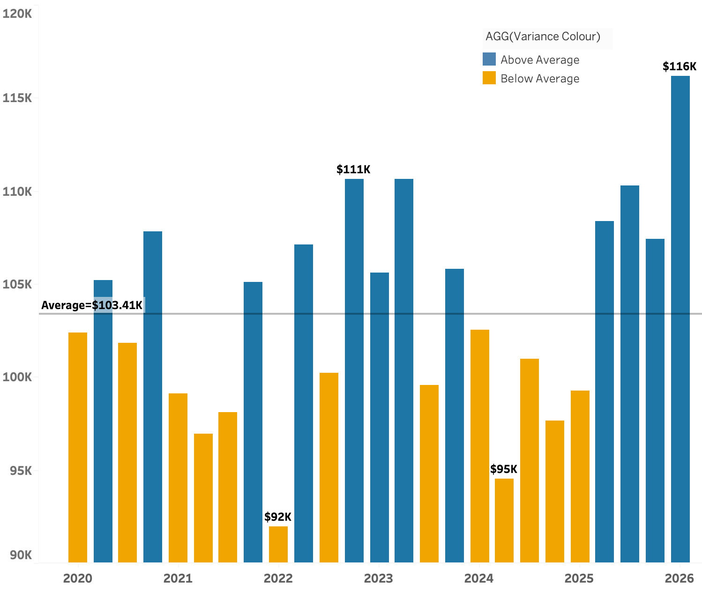
    </td>
  </tr>
</table>

 

<table align="center">
  <tr>
    <td width="900" align="center">
      <h3 align="center">Quarterly Revenue Variance from the $103.41K Benchmark</h3>
      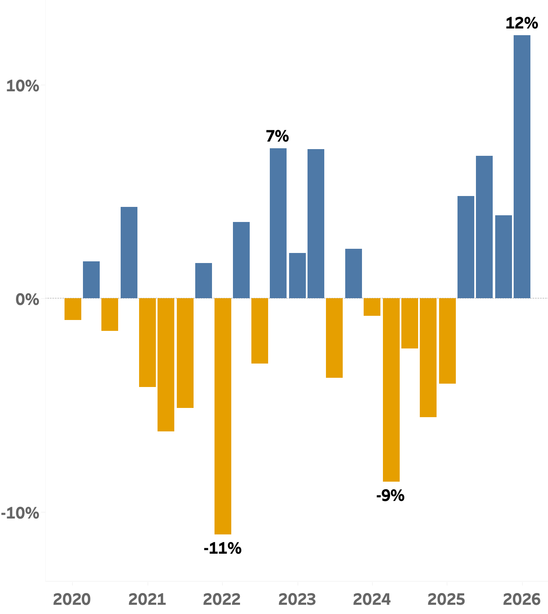
    </td>
  </tr>
</table>

 

<table align="center">
  <tr>
    <td width="450" valign="top">
      <ol>
        <li>
          <strong>Revenue Growth and Peak Performance</strong>
          <ul>
            <li>After revenue declined <strong>4.3% from $417.18K in 2020 to $399.25K in 2021</strong>, NexaCart returned to growth in 2022, when revenue increased <strong>2.7% to $409.93K</strong>.</li>
            <li>The strongest full-year result was recorded in <strong>2025</strong>: revenue reached <strong>$425.36K</strong>, representing <strong>7.5% year-on-year growth</strong> from 2024.</li>
            <li>Sales improves further in <strong>Q1 2026</strong>, when revenue peaked at a record of <strong>$116.15K</strong>—<strong>12.3% above</strong> the $103.41K quarterly benchmark and the highest quarter in the dataset.</li>
            <li>Because the 2026 data covers only Q1, this peak should be treated as a strong opening signal rather than evidence of full-year growth.</li>
          </ul>
        </li>
        <li>
          <strong>Growth Returned in 2023 Before a Broad-Based 2024 Downturn</strong>
          <ul>
            <li>Revenue increased <strong>2.8% to $421.59K in 2023</strong>, supported by Q1 and Q2 results that finished <strong>2.1% and 7.0% above</strong> the quarterly benchmark.</li>
            <li>The recovery was uneven: <strong>Q3 2023 fell 3.7% below</strong> the benchmark before Q4 recovered to <strong>2.3% above</strong> it.</li>
            <li>2024 experienced massive downturn below average sales with its annual revenue declined by<strong>6.2% to $395.66K</strong> and every quarter underperformed the benchmark: <strong>Q1 by 0.8%, Q2 by 8.6%, Q3 by 2.4% and Q4 by 5.6%</strong>.</li>
            <li>The below average performance in the four quarters in 2024 indicates a broad-based performance problem, rather than a single-quarter anomaly.</li>
          </ul>
        </li>
      </ol>
    </td>
    <td width="450" valign="top">
      <ol start="3">
        <li>
          <strong>Quarterly Insights &amp; Seasonal Trends</strong>
          <ul>
            <li>Q1 generally performed below average: it finished below the benchmark in <strong>2020 (-1.0%), 2021 (-4.2%), 2022 (-11.1%)—the lowest-performing quarter, 2024 (-0.8%) and 2025 (-4.0%)</strong>. The major exceptions were <strong>Q1 2023 (+2.1%)</strong> and the record <strong>Q1 2026 (+12.3%)</strong>.</li>
            <li>Q4 recorded above-average sales in <strong>2020 (+4.3%), 2022 (+7.0%) and 2023 (+2.3%)</strong>. However, <strong>Q4 2024 fell 5.6% below the benchmark</strong>, showing that Q4 strength was not consistent across every year.</li>
            <li>Sales performance experienced sustained growth from <strong>Q2 2025</strong>: revenue remained above average in <strong>Q2 (+4.8%), Q3 (+6.7%) and Q4 (+3.9%)</strong>, before reaching peak performance in <strong>Q1 2026 (+12.3%)</strong>.</li>
          </ul>
        </li>
        <li>
          <strong>Key Takeaways &amp; Recommendations</strong>
          <ul>
            <li><strong>Protect the recovery:</strong> identify the countries, products, customer tiers and channels driving the above-average <strong>Q2 2025–Q1 2026</strong> run, then focus inventory and marketing investment there.</li>
            <li><strong>Explain the 2024 decline:</strong> investigate the drivers of below-average sales performance, including return rate, internal factors, AOV, churn rate and competition.</li>
            <li><strong>Reproduce strong-quarter strategies:</strong> NexaCart should use the tactics associated with high-performing quarters to refine its marketing and sales strategies.</li>
            <li><strong>Forecast 2026 cautiously:</strong> update Q2–Q4 rolling forecasts and confirm whether the record <strong>$116.15K</strong> in Q1 reflects sustainable order growth.</li>
          </ul>
        </li>
      </ol>
    </td>
  </tr>
</table>

<h2 align="center">Dataset Structure and ERD (Entity Relationship Diagram)</h2>

  The NexaCart database contains <strong>33,215 rows</strong> across four tables. The <strong>orders</strong> table is the central transactional (fact) table: it connects to customers through <strong>customer_id</strong>, to product summary through the composite key <strong>category + product_name</strong>, and to monthly revenue through the composite key <strong>year + month</strong>. The tables connect through one-to-many relationships that preserve order-level detail and support time-based analysis.

  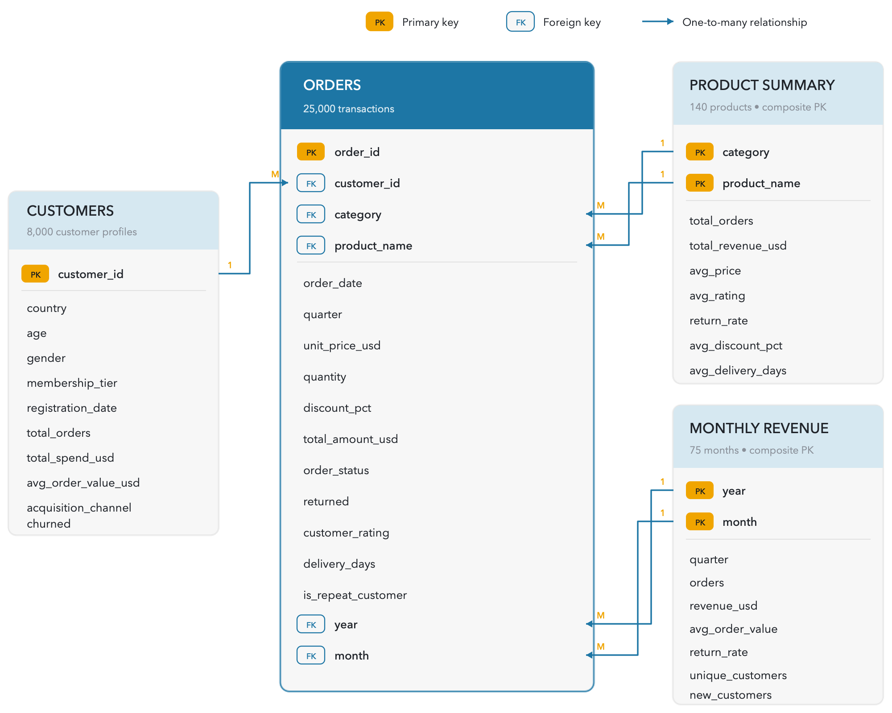

<h1 align="center">Insights Deep-Dive</h1>

<h2 align="center">Sales Revenue</h2>

<table align="center">
  <tr>
    <td width="900" align="center">
      
    </td>
  </tr>
</table>

 

<table align="center">
  <tr>
    <td width="900" valign="top">
      <ol>
        <li>
          <strong>Peak Revenue in 2026 Q1 following a sustained recovery</strong>
          <ul>
            <li>Quarterly delivered revenue reached <strong>$116.15K</strong> in <strong>Q1 2026</strong>, the highest result in the reporting period and <strong>12.3%</strong> above the quarterly average of <strong>$103.41K</strong>.</li>
            <li><strong>2026 Q1</strong> revenue marks a <strong>17.0%</strong> increase Compared with <strong>Q1 2025</strong>, indicating a strong improvement after sustained above average performance.</li>
            <li>A high level of sustained recovery began in <strong>Q2 2025</strong>, and remained above average for four consecutive quarters: <strong>Q2 2025 (+4.8%)</strong>, <strong>Q3 2025 (+6.7%)</strong>, <strong>Q4 2025 (+3.9%)</strong> and <strong>Q1 2026 (+12.3%)</strong>.</li>
          </ul>
        </li>
        <li>
          <strong>Q1 2022 - Significant revenue downturn</strong>
          <ul>
            <li>A very sharp decline of revenue to <strong>$91.96K</strong> in <strong>Q1 2022</strong>, the lowest sale performance and <strong>11.1%</strong> below the overall quarterly benchmark.</li>
            <li>This represented a <strong>12.5%</strong> quarter-on-quarter decline from <strong>$105.09K</strong> in <strong>Q4 2021</strong>, making it the largest consecutive-quarter revenue contraction in the reporting period.</li>
            <li>The decline was followed by an immediate <strong>16.5%</strong> recovery to <strong>$107.10K</strong> in <strong>Q2 2022</strong>, indicating that <strong>Q1 2022</strong> was a sharp temporary disruption rather than the beginning of a sustained annual collapse.</li>
          </ul>
        </li>
        <li>
          <strong>Volatile Revenue performance and relatively stable annual totals</strong>
          <ul>
            <li>Full-year revenue remains in a narrow range of <strong>$395.66K–$425.36K</strong> between <strong>2020</strong> and <strong>2025</strong>, although quarterly results fluctuated considerably.</li>
            <li><strong>2025</strong> was the best performing year, with an annual total of <strong>$425.36K</strong> (an increase of <strong>7.5%</strong> from <strong>$395.66K</strong> in <strong>2024</strong>).</li>
            <li><strong>2024</strong> sustained consistently below-average sales performance. Potential drivers—including weaker demand, lower consumer spending, increased competition or poor marketing performance—require further investigation.</li>
          </ul>
        </li>
      </ol>
    </td>
  </tr>
</table>

 

<table align="center">
  <tr>
    <td width="450" align="center" valign="top">
      <h5 align="center">Average Order Value</h5>
      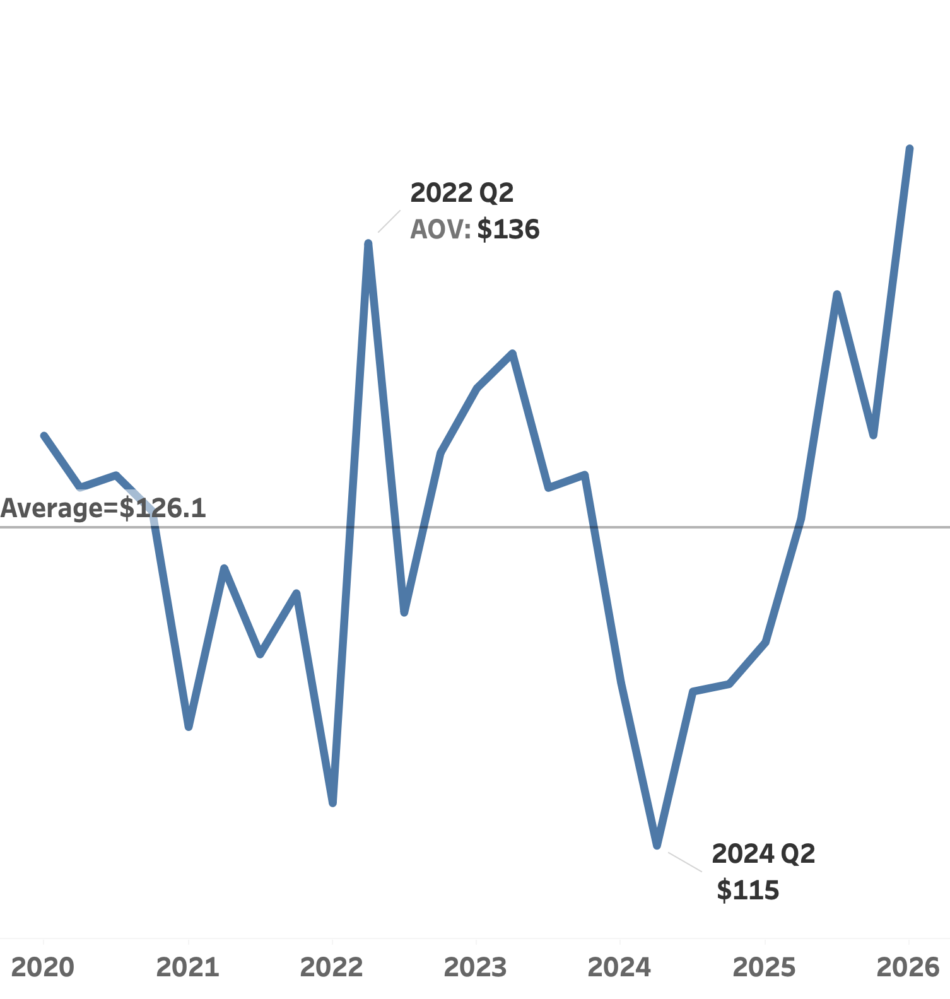
    </td>
    <td width="450" align="center" valign="top">
      <h5 align="center">Order Volume</h5>
      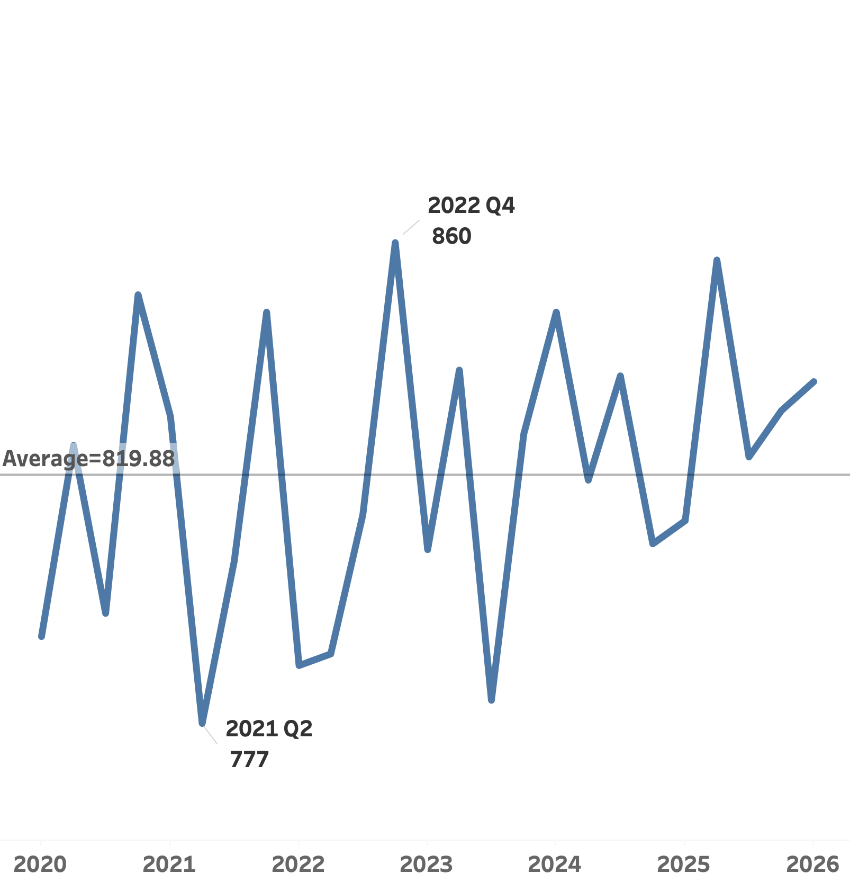
    </td>
  </tr>
</table>

 

<table align="center">
  <tr>
    <td width="900" valign="top">
      <h3 align="left">Average Order Value</h3>
      <ol>
        <li>
          <strong>AOV Surged in 2022 and Declined Sharply in 2024</strong>
          <ul>
            <li>AOV surged in <strong>Q2 2022 ($136)</strong> and <strong>Q1 2026 ($139)</strong>, while <strong>Q2 2024</strong> recorded a significant below-average decline.</li>
            <li>Delivered AOV averaged <strong>$126.12</strong> across the reporting period, ranging from <strong>$115.41</strong> in <strong>Q2 2024</strong> to a record <strong>$138.94</strong> in <strong>Q1 2026</strong>.</li>
          </ul>
        </li>
        <li>
          <strong>Sustained Below-Average AOV Performance Between 2021 and Q1 2022</strong>
          <ul>
            <li>AOV fell to <strong>$119</strong> in <strong>Q1 2021</strong>, a <strong>5.8%</strong> decline from <strong>Q4 2020</strong>, and remained at a comparatively low level through <strong>Q4 2021</strong>.</li>
            <li>A further decline to <strong>$116.84</strong> in <strong>Q1 2022</strong>, which was <strong>7.4%</strong> below the overall AOV average benchmark of <strong>$126.12</strong>.</li>
            <li>AOV followed a similar sustained downturn from <strong>2021 to Q1 2022</strong> as the revenue trend, indicating that lower transaction value affected revenue during the period.</li>
            <li>AOV declined by <strong>5.7%</strong> from <strong>$123.93</strong> in <strong>Q4 2021</strong> to <strong>$117</strong> in <strong>Q1 2022</strong>, while delivered order volume also declined by <strong>7.2%</strong>. Together, these movements contributed to the record-low revenue of <strong>$91.96K</strong>.</li>
            <li>In <strong>Q2 2022</strong>, AOV rebounded by <strong>16.2%</strong> to <strong>$135.75</strong>, while order volume increased by only <strong>0.3%</strong> from <strong>787</strong> to <strong>789 orders</strong>. Revenue consequently recovered by <strong>16.5%</strong> to <strong>$107.10K</strong>, demonstrating that the <strong>Q2</strong> improvement was driven primarily by greater spending per order rather than additional transactions.</li>
          </ul>
        </li>
        <li>
          <strong>Revenue Was Impacted by AOV in 2024</strong>
          <ul>
            <li>Annual AOV declined by <strong>7.8%</strong>, from <strong>$129.60</strong> in <strong>2023</strong> to <strong>$119.46</strong> in <strong>2024</strong>, with the lowest customer spending in <strong>2024 Q2 ($115)</strong>.</li>
            <li>In <strong>2024</strong>, delivered orders increased by <strong>1.8%</strong>, from <strong>3,253</strong> to <strong>3,312</strong>, yet revenue declined by <strong>6.2%</strong> to <strong>$395.66K</strong>, indicating that lower AOV was a major factor affecting revenue.</li>
          </ul>
        </li>
      </ol>
      <h3 align="left">Order Volume</h3>
      <ol>
        <li>
          <strong>AOV Impacts Revenue more than Order Volume</strong>
          <ul>
            <li>Revenue ranged from <strong>$91.96K</strong> to <strong>$116.15K</strong> over the years (<strong>26.3%</strong> range) while AOV ranged from <strong>$115.41</strong> to <strong>$138.94</strong> (<strong>20.4%</strong> difference).</li>
            <li>Quarterly delivered orders averaged <strong>819.88</strong>, with a low of <strong>777 orders</strong> in <strong>Q2 2021</strong> and a high of <strong>860 orders</strong> in <strong>Q4 2022</strong> (<strong>10.7%</strong> range) - indicating changes in transaction value were more influential in producing the largest revenue fluctuations.</li>
          </ul>
        </li>
      </ol>
    </td>
  </tr>
</table>

<h2 align="center">Product Performance</h2>

<table align="center">
  <tr>
    <td width="900" align="center">
      <h3 align="center">Revenue Is Concentrated Among the Leading Technology Products</h3>
      <h5 align="center">(Top 15 Product Sales Revenue)</h5>
      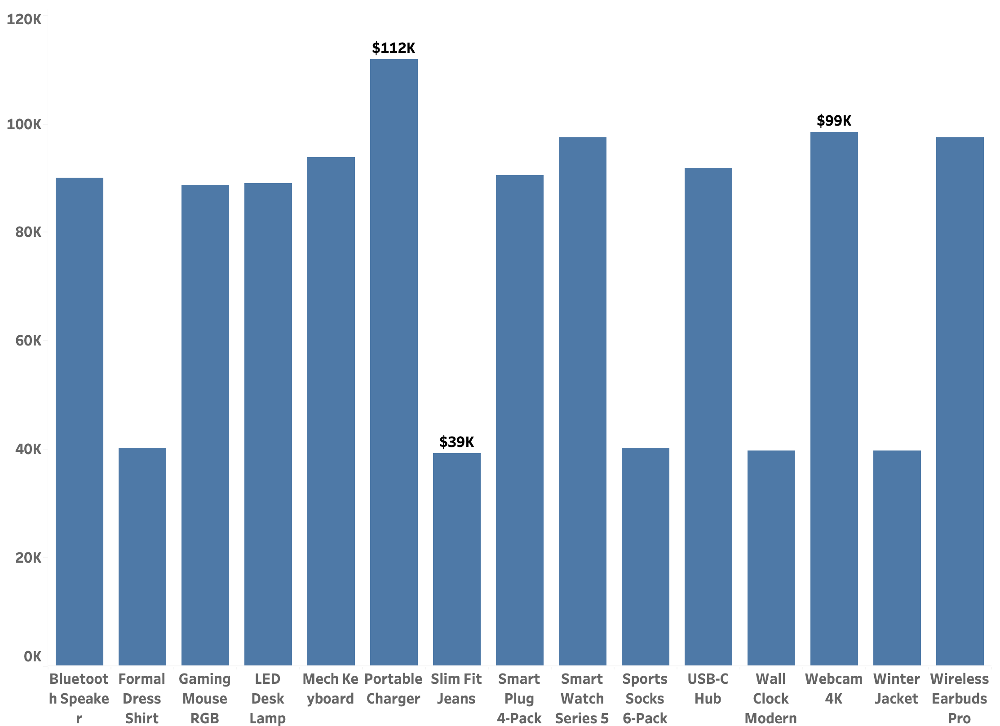
    </td>
  </tr>
</table>

 

<table align="center">
  <tr>
    <td width="900" valign="top">
      <ul>
        <li><strong>Portable Charger 20000mAh</strong> is the best-performing product, generating <strong>$111.87K</strong> in delivered revenue. It outperformed second-ranked <strong>Webcam 4K ($98.52K)</strong> by <strong>13.6%</strong> and generated approximately <strong>3 times</strong> the revenue of <strong>Slim Fit Jeans ($39.28K)</strong>.</li>
        <li>The fifteen leading products generated a combined <strong>$1,148.22K</strong>, representing approximately <strong>44.4%</strong> of NexaCart’s total delivered revenue. This shows significant revenue concentration around technology products, electronic accessories and few apparel products.</li>
        <li>The <strong>Slim Fit Jeans ($39.28K)</strong>, <strong>Wall Clock Modern ($39.63K)</strong>, <strong>Winter Jacket ($39.71K)</strong>, <strong>Formal Dress Shirt ($40.18K)</strong> and <strong>Sports Socks 6-Pack ($40.23K)</strong> performed relatively low compared to others in the top performing 15 products. Together, they generated <strong>$199.04K (17.3%)</strong> compared to the technology products (<strong>82.7%</strong>) indicating category level performance gap.</li>
      </ul>
    </td>
  </tr>
</table>

 

<table align="center">
  <tr>
    <td width="900" align="center">
      <h3 align="center">Top 15 product sales Heat Map by Quarter</h3>
      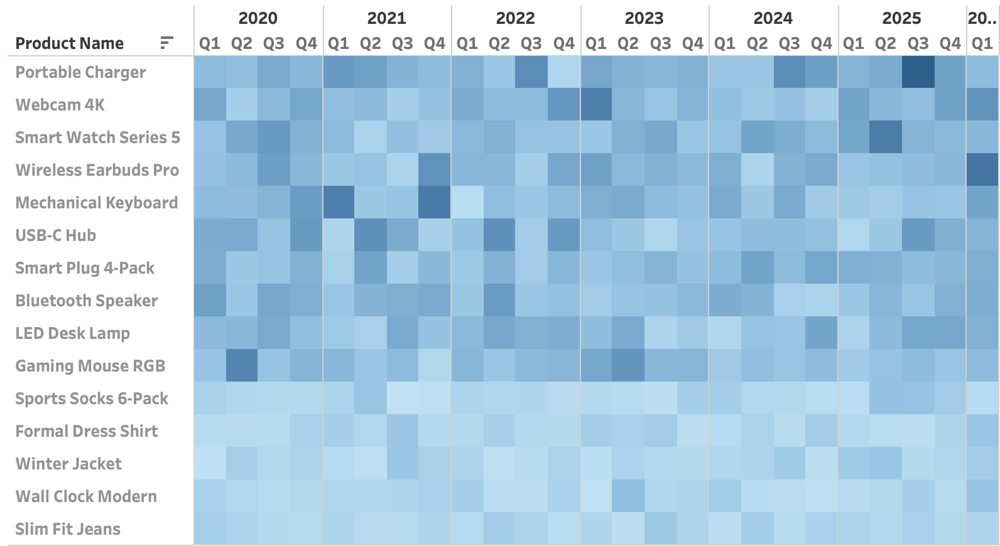
      

        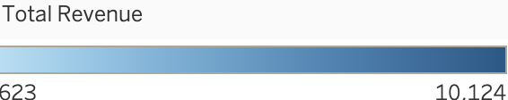
      

    </td>
  </tr>
</table>

 

<table align="center">
  <tr>
    <td width="900" valign="top">
      <ul>
        <li>The best combined quarter for the fifteen products was <strong>Q1 2026</strong>, when they generated <strong>$58.61K</strong>—approximately <strong>27.6%</strong> above their quarterly average of <strong>$45.93K</strong>. Performance was led by <strong>Wireless Earbuds Pro ($8.65K)</strong>, <strong>Webcam 4K ($6.34K)</strong> and <strong>Mechanical Keyboard ($5.20K)</strong>.</li>
        <li>The weakest aggregated periods were <strong>Q1 2025 ($39.76K)</strong>, <strong>Q3 2022 ($39.95K)</strong> and <strong>Q1 2022 ($40.77K)</strong>.</li>
        <li><strong>Portable Charger</strong> has the highest sales performance (<strong>$10.12K</strong>) in <strong>Q3 2025</strong>. In contrast, <strong>Mechanical Keyboard</strong> declined to <strong>$1.06K</strong> in <strong>Q1 2022</strong>, while <strong>Wall Clock Modern</strong> recorded only <strong>$0.62K</strong> in <strong>Q1 2023</strong>.</li>
        <li>The few leading apparel products (<strong>Sports Socks 6-Pack, Formal Dress Shirt, Winter Jacket and Slim Fit Jeans</strong>) performed relatively poorly across the reporting period, although Sports Socks 6-Pack improved in <strong>Q2, Q3 and Q4 2025</strong>.</li>
      </ul>
    </td>
  </tr>
</table>

<h2 align="center">Product Return Rate</h2>

<table align="center">
  <tr>
    <td width="900" align="center">
      <h3 align="center">Return Rates Remained Relatively Constant, with Significant Spikes in Q1 2022 and Q4 2025</h3>
      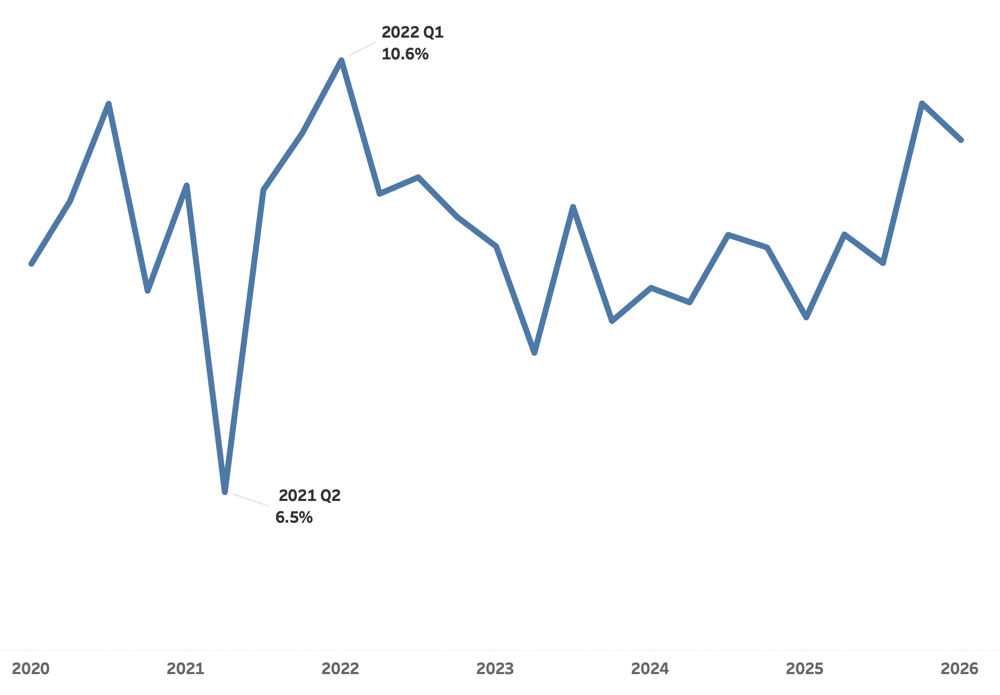
    </td>
  </tr>
</table>

 

<table align="center">
  <tr>
    <td width="900" align="center">
      <h3 align="center">Quarterly Product Return Rate Heat Map</h3>
      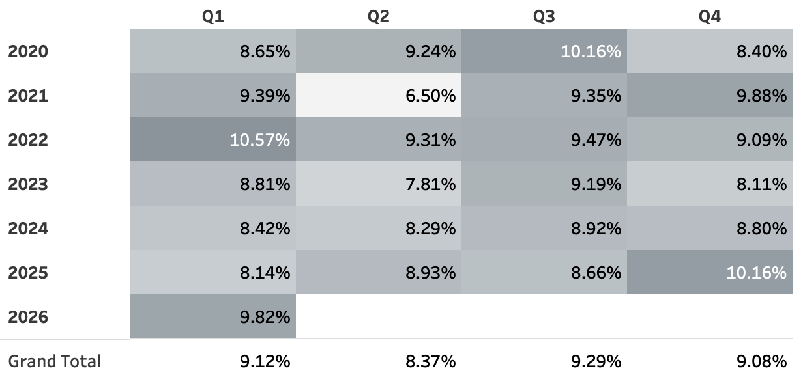
    </td>
  </tr>
</table>

 

<table align="center">
  <tr>
    <td width="900" valign="top">
      <ul>
        <li>NexaCart recorded <strong>2,020 returned orders</strong> from <strong>22,517 fulfilled orders</strong>, with an average total return rate of <strong>8.97%</strong>. This implies that approximately <strong>9 out of every 100 fulfilled orders</strong> were returned during the reporting period.</li>
        <li><strong>Q1 2022</strong> recorded the highest quarterly return rate at <strong>10.57% (93 returns from 880 fulfilled orders)</strong>, while the minimum was <strong>6.50% in Q2 2021</strong>.</li>
        <li>At the annual level, <strong>2022</strong> experienced the highest return rate at <strong>9.60%</strong>, representing <strong>345 returned orders</strong>. Performance subsequently improved to <strong>8.47% in 2023</strong> and <strong>8.61% in 2024</strong>.</li>
        <li>The return rate increased again towards the end of <strong>2025</strong>, rising from <strong>8.66% in Q3 2025</strong> to <strong>10.16% in Q4 2025</strong>, and remained elevated in <strong>Q1 2026 (9.82%)</strong>. NexaCart’s operations and logistics department should monitor the recent increase rather than treat it as an isolated fluctuation.</li>
        <li>The <strong>three highest return rates</strong> occurred in different quarters (<strong>Q3 2020, Q1 2022 and Q4 2025</strong>), suggesting that the spikes were not part of a consistent seasonal pattern. Management should perform a drill-down analysis to identify the causes.</li>
      </ul>
    </td>
  </tr>
</table>

<h2 align="center">Order Status</h2>

<h3 align="center">Delivered Orders Dominated the Order-Status Distribution</h3>

<table align="center">
  <tr>
    <td width="450" align="center" valign="top">
      <h5 align="center">Order Status Trend</h5>
      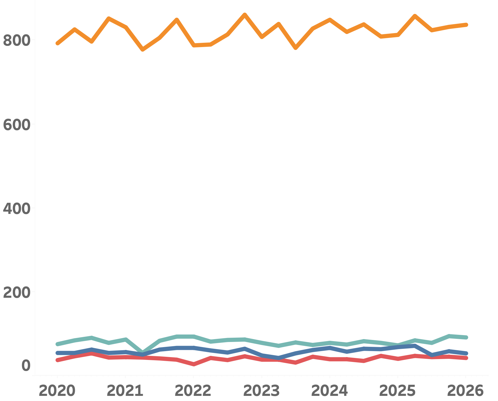
    </td>
    <td width="450" align="center" valign="top">
      <h5 align="center">Order Mix by Status</h5>
      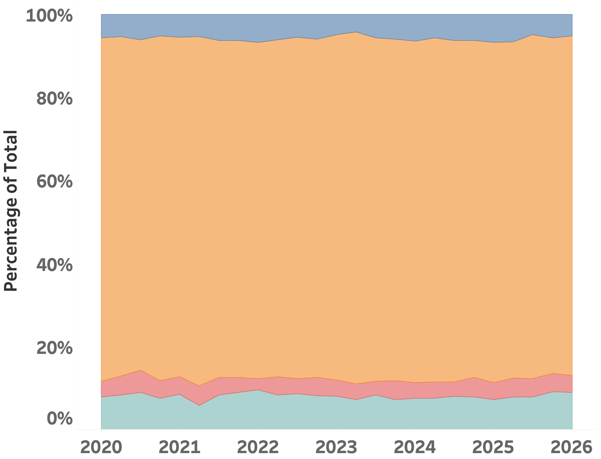
    </td>
  </tr>
  <tr>
    <td colspan="2" width="900" align="right">
      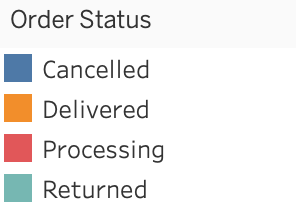
    </td>
  </tr>
</table>

 

<table align="center">
  <tr>
    <td width="900" valign="top">
      <ul>
        <li>Delivered orders dominated the order-status distribution, accounting for <strong>20,497 of 25,000 orders (82.0%)</strong>. Returned orders represented <strong>8.1%</strong>, cancelled orders <strong>5.8%</strong>, and processing orders <strong>4.1%</strong>. Consequently, cancellations and processing together accounted for <strong>9.9%</strong> of all orders.</li>
        <li>Quarterly delivered volume remained highly stable, averaging approximately <strong>820 orders</strong> and ranging from <strong>777 in Q2 2021</strong> to <strong>860 in Q4 2022</strong>.</li>
        <li>The non-delivered statuses displayed greater relative volatility. Returns peaked at <strong>94 in Q4 2025</strong> and remained elevated at <strong>91 in Q1 2026</strong>, while cancellations reached <strong>71 in Q2 2025</strong>.</li>
      </ul>
    </td>
  </tr>
</table>

<h2 align="center">Customer Acquisition Channel Analysis</h2>

<table align="center">
  <tr>
    <td width="450" align="center" valign="top">
      <h5 align="center">Purchasing Customers by Acquisition Channel</h5>
      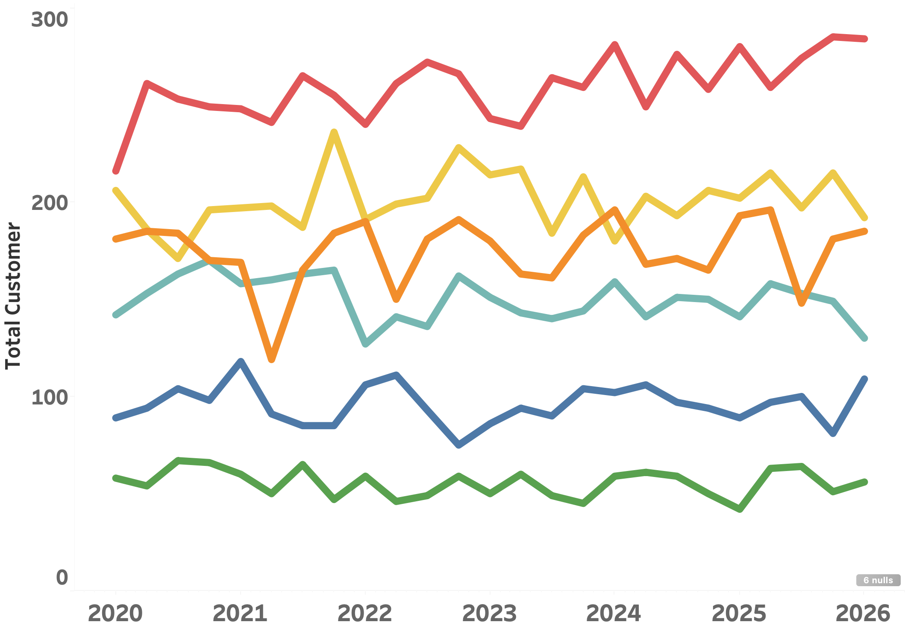
    </td>
    <td width="450" align="center" valign="top">
      <h5 align="center">Customer Acquisition Channel Mix</h5>
      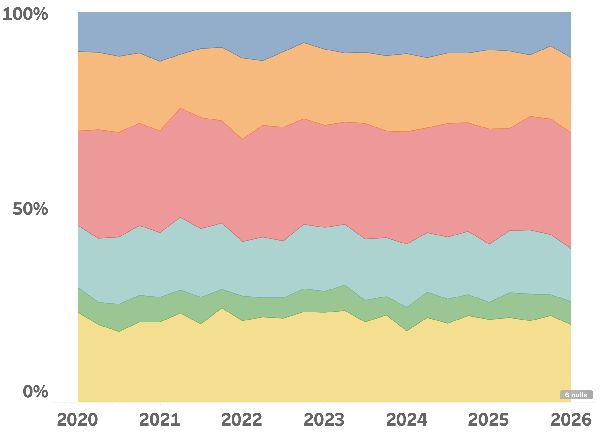
    </td>
  </tr>
  <tr>
    <td colspan="2" width="900" align="right">
      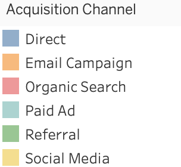
    </td>
  </tr>
</table>

 

<table align="center">
  <tr>
    <td width="900" valign="top">
      <ul>
        <li><strong>Organic Search</strong> is NexaCart’s leading acquisition channel, contributing <strong>2,086 distinct purchasing customers (27.2%)</strong>, <strong>6,897 orders (27.6%)</strong> and <strong>$870.15K in revenue (27.7%)</strong>. It contributed an average of approximately <strong>259 active customers per quarter</strong> and remained the highest-volume channel throughout the reporting years.</li>
        <li><strong>Social Media</strong> ranked second with <strong>1,683 purchasing customers (22.0%)</strong> and <strong>$662.06K in revenue (21.1%)</strong>. <strong>Organic Search and Social Media</strong> together contributed <strong>49.2%</strong> of purchasing customers and approximately <strong>48.9%</strong> of revenue, indicating NexaCart’s strong dependence on digital discovery channels.</li>
        <li><strong>Email Campaigns and Paid Ads</strong> contributed fairly, jointly contributing <strong>34.6%</strong> of purchasing customers and <strong>34.8%</strong> of revenue. Email Campaign contribution ranged from <strong>119 customers in Q2 2021</strong> to <strong>196 in Q1 2024 and Q2 2025</strong>, while Paid Ads remained comparatively stable, averaging <strong>150 customers per quarter</strong>.</li>
        <li><strong>Direct (10.3%)</strong> and <strong>Referral (6.0%)</strong> contributed the smallest customer shares, while the acquisition mix remained broadly stable with little or no major structural shift throughout the reporting years.</li>
      </ul>
    </td>
  </tr>
</table>

<h2 align="center">Membership Tier Analysis</h2>

<table align="center">
  <tr>
    <td width="900" align="center">
      <h3 align="center">Free Members Generated the Largest Share of Delivered Revenue</h3>
      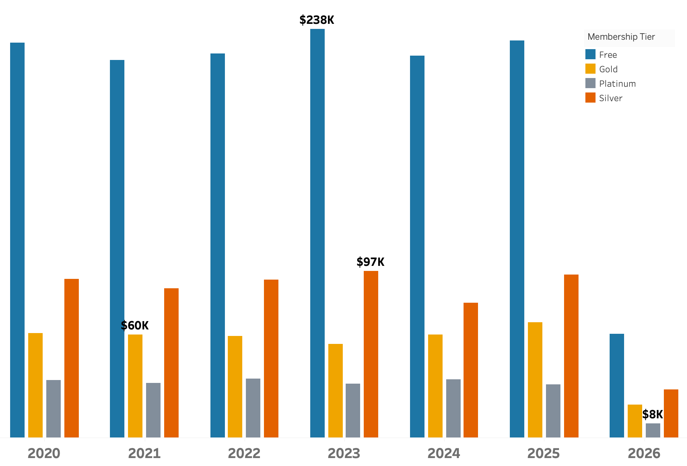
    </td>
  </tr>
</table>

 

<table align="center">
  <tr>
    <td width="900" valign="top">
      <ul>
        <li><strong>Free members</strong> generated <strong>$1.43M</strong>, representing <strong>55.2%</strong> of delivered revenue, and placed <strong>11,399 delivered orders (55.6% of total orders)</strong>. Annual revenue from this tier remained consistently between <strong>$220.14K and $238.07K per year</strong> during the reporting years, indicating that NexaCart’s revenue heavily depends on its free-member population.</li>
        <li><strong>Silver members</strong> contributed <strong>$570.64K (22.1%)</strong> in revenue and recorded the highest tier-level AOV at <strong>$128.90</strong>, making them the highest-paying tier. Silver revenue peaked at <strong>$97.01K in 2023</strong>, declined by <strong>18.8% to $78.79K in 2024</strong>, and later recovered by <strong>20.7% to $95.11K in 2025</strong>, demonstrating a significant and reversible performance downturn.</li>
        <li><strong>Gold and Platinum members</strong> contributed <strong>$381.81K (14.8%)</strong> and <strong>$205.92K (8.0%)</strong>, respectively. Platinum is the lowest-revenue tier, and Gold reached its highest annual revenue of <strong>$67.53K in 2025</strong>.</li>
        <li>The <strong>2026</strong> values represent only <strong>Q1</strong> and should not be compared directly with full-year totals. Q1 generated <strong>$60.60K from Free</strong>, <strong>$28.16K from Silver</strong>, <strong>$19.17K from Gold</strong>, and <strong>$8.22K from Platinum</strong> tiers.</li>
      </ul>
    </td>
  </tr>
</table>

 

<table align="center">
  <tr>
    <td width="900" align="center">
      <h3 align="center">Silver Members Recorded the Highest Tier-Level AOV</h3>
      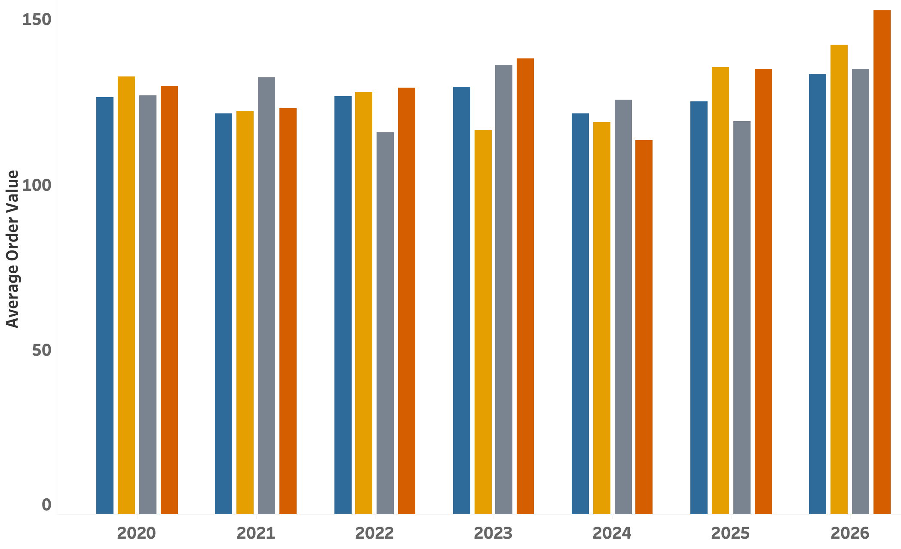
    </td>
  </tr>
</table>

<h2 align="center">Geographical Performance Analysis</h2>

<table align="center">
  <tr>
    <td width="900" align="center">
      <h3 align="center">The United States Leads Revenue While Return Rates Vary Across Markets</h3>
      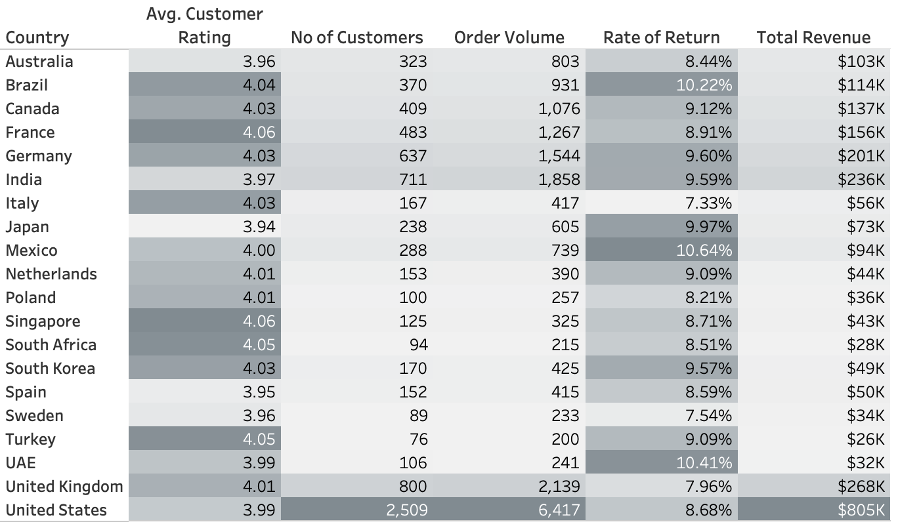
    </td>
  </tr>
</table>

 

<table align="center">
  <tr>
    <td width="900" valign="top">
      <ul>
        <li><strong>United States</strong> generated <strong>$805K</strong> from <strong>6,417 delivered orders</strong> and <strong>2,509 customers</strong>, representing approximately <strong>31.1% of total delivered revenue</strong>. The revenue generated is proportional to its customer and order-volume share, indicating that market size is the primary performance driver.</li>
        <li><strong>Revenue is concentrated within four major markets.</strong> The United States ($805K), United Kingdom ($268K), India ($236K) and Germany ($201K) are the top four performing countries and collectively generated approximately <strong>$1.51M</strong>, equivalent to <strong>58.4% of total delivered revenue</strong>. The United Kingdom has a relatively low <strong>7.96% return rate</strong>, compared with <strong>9.59%</strong> in India and <strong>9.60%</strong> in Germany.</li>
        <li><strong>Mexico recorded the highest return rate at 10.64%</strong>, followed by the UAE at <strong>10.41%</strong>, Brazil at <strong>10.22%</strong> and Japan at <strong>9.97%</strong>, all above the company average benchmark of approximately <strong>8.97%</strong>. Comparatively, Italy, Sweden and the United Kingdom achieved substantially lower rates of <strong>7.33%</strong>, <strong>7.54%</strong> and <strong>7.96%</strong>, respectively, indicating better customer product satisfaction or closer alignment between customer expectations and delivered products.</li>
        <li><strong>Customer ratings are consistent, but commercial performance varies significantly.</strong> Average ratings range narrowly from <strong>3.94</strong> in Japan to approximately <strong>4.06</strong> in France and Singapore (a spread of only <strong>0.12 points)</strong>. However, revenue ranges from <strong>$26K</strong> in Turkey to <strong>$805K</strong> in the United States. This suggests that geographic revenue performance is influenced more by customer-base size, order frequency and market penetration than by customer satisfaction alone.</li>
      </ul>
    </td>
  </tr>
</table>

<h1 align="center">Recommendations</h1>

<table align="center">
  <tr>
    <td width="450" valign="top">
      <h3 align="left">Sales Department</h3>
      <ul>
        <li>
          <strong>Protect the recent revenue recovery and raise Average Order Value.</strong>
          <ul>
            <li>Maintain the products, campaigns and market activities that supported four consecutive above-average quarters from <strong>Q2 2025 to Q1 2026</strong>—NexaCart’s first four-quarter run of above-average sales.</li>
            <li>Use product bundles, cross-selling and carefully targeted discounts to keep AOV above the <strong>$126.12 benchmark</strong>. In <strong>2024</strong>, delivered orders increased by <strong>1.8%</strong>, but AOV declined by <strong>7.8%</strong>, contributing to a <strong>6.2% revenue decline</strong>.</li>
          </ul>
        </li>
        <li>
          <strong>Use Q1 2026 momentum to address recurring first-quarter weakness.</strong>
          <ul>
            <li>First-quarter performance has generally remained below average, with <strong>Q1 2022</strong> recording the lowest result at approximately <strong>$92K</strong>. Identify the tactics behind the strong <strong>Q1 2026</strong> result and apply them across the January–March period.</li>
          </ul>
        </li>
      </ul>
      <h3 align="left">Product Department</h3>
      <ul>
        <li>
          <strong>Prioritise inventory and promotion for proven technology products.</strong>
          <ul>
            <li>Maintain sufficient stock and prominent website placement for products such as <strong>Portable Charger 20000mAh ($111.87K)</strong> and <strong>Webcam 4K ($98.52K)</strong>.</li>
            <li>Technology products contribute most of the revenue within the selected leading-product group, so stockouts could have a disproportionate effect on sales.</li>
          </ul>
        </li>
        <li>
          <strong>Create a structured improvement plan for lower-performing products.</strong>
          <ul>
            <li>Test price changes, product bundles, website placement and targeted promotions for products including <strong>Slim Fit Jeans ($39.28K)</strong>, <strong>Wall Clock Modern ($39.63K)</strong> and <strong>Winter Jacket ($39.71K)</strong>.</li>
            <li>Review results after each quarter. Products that continue to underperform should receive lower inventory allocations, while products responding positively should receive further support.</li>
          </ul>
        </li>
      </ul>
      <h3 align="left">Returns and Refund Management</h3>
      <ul>
        <li>
          <strong>Investigate return-rate hotspots.</strong>
          <ul>
            <li>Conduct product, category, country and delivery-time drill-downs for <strong>Q1 2022 (10.57%)</strong>, <strong>Q4 2025 (10.16%)</strong> and <strong>Q1 2026 (9.82%)</strong>, alongside the narrow customer-rating range of approximately <strong>3.94–4.06</strong>.</li>
            <li>Prioritise <strong>Mexico, the UAE, Brazil and Japan</strong>, where return rates reached <strong>10.64%</strong>, <strong>10.41%</strong>, <strong>10.22%</strong> and <strong>9.97%</strong>, respectively.</li>
          </ul>
        </li>
      </ul>
    </td>
    <td width="450" valign="top">
      <h3 align="left">Membership Tier</h3>
      <ul>
        <li>
          <strong>Convert more Free members without weakening the company’s largest revenue base.</strong>
          <ul>
            <li>Free members generated <strong>$1.43M</strong>, representing <strong>55.2%</strong> of delivered revenue. NexaCart should continue providing a strong basic customer experience to this tier while creating clear upgrade pathways.</li>
          </ul>
        </li>
        <li>
          <strong>Strengthen Silver performance and clarify premium-tier benefits.</strong>
          <ul>
            <li>Silver members produced the highest tier-level AOV of <strong>$128.90</strong> and <strong>$570.64K</strong> in revenue. Target this group with personalised bundles and retention offers.</li>
            <li>Review the benefits offered to Gold and Platinum members, which contributed only <strong>14.8%</strong> and <strong>8.0%</strong> of revenue. Benefits should encourage increased purchasing frequency and spending.</li>
          </ul>
        </li>
      </ul>
      <h3 align="left">Customer Acquisition Channel</h3>
      <ul>
        <li>
          <strong>Protect Organic Search and Social Media while reducing channel-concentration risk.</strong>
          <ul>
            <li>These two channels generated <strong>49.2%</strong> of purchasing customers and approximately <strong>48.9%</strong> of revenue, making them essential to customer and revenue growth.</li>
            <li>Continue search optimisation and social-content investment, but monitor dependence on these channels and strengthen the remaining channels, which contributed approximately <strong>51.1%</strong> of revenue.</li>
          </ul>
        </li>
      </ul>
      <h3 align="left">Country Performance</h3>
      <ul>
        <li>
          <strong>Prioritise the strongest markets and develop the United Kingdom as a growth market.</strong>
          <ul>
            <li>The <strong>United States, United Kingdom, India and Germany</strong> generated <strong>58.4%</strong> of delivered revenue. Protect inventory availability, delivery capacity and local campaigns in these markets.</li>
            <li>The United Kingdom generated <strong>$268K</strong> with a comparatively low <strong>7.96% return rate</strong>, making it a strong candidate for targeted customer acquisition and product-range expansion.</li>
          </ul>
        </li>
        <li>
          <strong>Use operating metrics rather than customer ratings alone.</strong>
          <ul>
            <li>Customer ratings range narrowly from <strong>3.94 to 4.06</strong>, while country revenue ranges from <strong>$26K to $805K</strong>. Market size, customer base, order volume and return rate should therefore guide location-related operations and decisions.</li>
          </ul>
        </li>
      </ul>
    </td>
  </tr>
  <tr>
    <td colspan="2" width="900">
      
<strong>Note:</strong> <strong>2026</strong> contains only <strong>Q1</strong>, so it should not be compared directly with complete financial years.

    </td>
  </tr>
</table>
