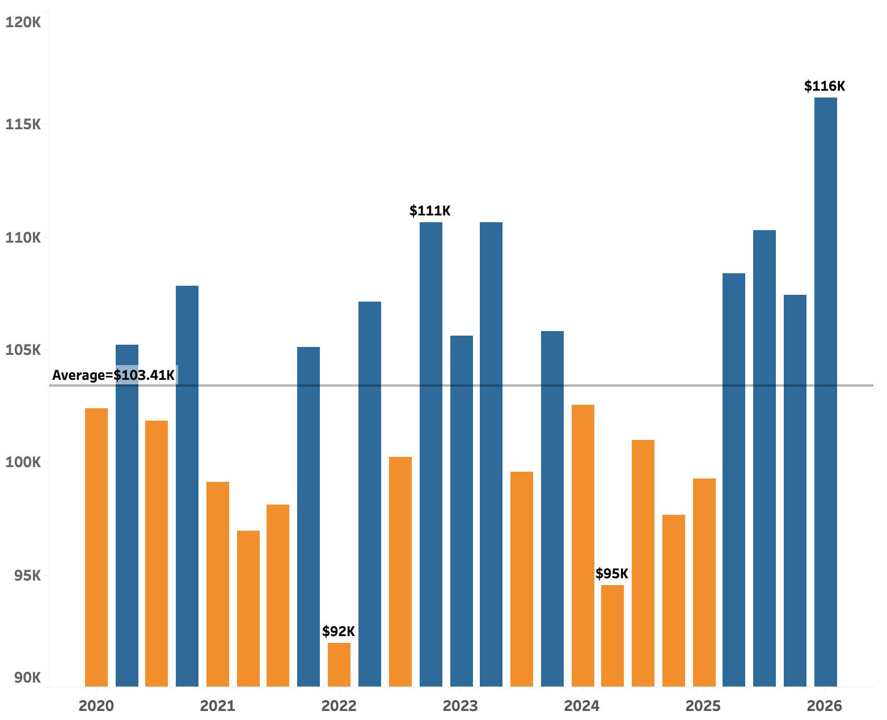
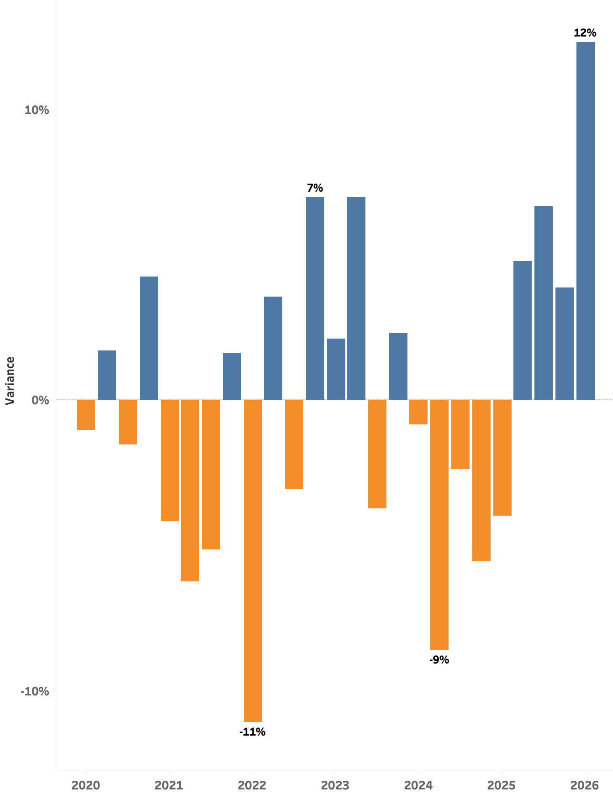

<h1 align="center">NexaCart Global E-commerce Performance Report</h1>

<table align="center">
  <tr>
    <td width="900">
      <h2 align="center">Client Background</h2>
      

        NexaCart Global is a multinational e-commerce company offering a diverse range of consumer products through its digital marketplace. Established in 2019, the company serves customers across <strong>20 countries</strong> and operates across <strong>14 product categories</strong>.
      

      

        The NexaCart database contains approximately <strong>25,000 customer orders</strong> and transaction activity covering <strong>2020 to Q1 2026</strong>, with total revenue of approximately <strong>$2.59 million</strong>. The available data is organised into four tables: <strong>orders, customers, product summary and monthly revenue</strong>. Together, these tables provide the measures and dimensions required to evaluate sales, customer behaviour, product performance, acquisition channels, customer tiers and geographic demand.
      

      

        To support its next phase of growth, NexaCart Global commissioned a comprehensive customer and sales performance analysis covering its years of operation from <strong>2020 to Q1 2026</strong>. Reporting to the <strong>Chief Commercial Officer</strong>, the analysis is designed to provide evidence-based insights that support better commercial decisions and improve operational performance. The key insights and recommendations focus on the following areas:
      

      <h3 align="center">Northstar Metrics</h3>
      <ul>
        <li><strong>Sales performance</strong> - Evaluate revenue trends, order volume, units sold and average order value across time and countries.</li>
        <li><strong>Product performance</strong> - Identify high-performing and underperforming products, understand their commercial impact and compare return rates across the years of operation.</li>
        <li><strong>Customer acquisition channel and customer tier</strong> - Evaluate acquisition channels and customer tiers to identify the most effective routes to market and support the NexaCart marketing team.</li>
        <li><strong>Country performance</strong> - Examine revenue, customer satisfaction and product demand across NexaCart's countries of operation to identify strong markets and improvement opportunities.</li>
      </ul>
    </td>
  </tr>
</table>

<h1 align="center">Executive Summary</h1>

<table align="center">
  <tr>
    <td width="900" align="center">
      <h3 align="center">Revenue Remained Volatile Across the Years and Peaked in Q1 2026</h3>
      
    </td>
  </tr>
</table>

 

<table align="center">
  <tr>
    <td width="900" align="center">
      <h3 align="center">Quarterly Revenue Variance from the $103.41K Benchmark</h3>
      
    </td>
  </tr>
</table>

 

<table align="center">
  <tr>
    <td width="450" valign="top">
      <ol>
        <li>
          <strong>Revenue Growth and Peak Performance</strong>
          <ul>
            <li>After revenue declined <strong>4.3% from $417.18K in 2020 to $399.25K in 2021</strong>, NexaCart returned to growth in 2022, when revenue increased <strong>2.7% to $409.93K</strong>.</li>
            <li>The strongest full-year result was recorded in <strong>2025</strong>: revenue reached <strong>$425.36K</strong>, representing <strong>7.5% year-on-year growth</strong> from 2024.</li>
            <li>Sales improves further in <strong>Q1 2026</strong>, when revenue peaked at a record of <strong>$116.15K</strong>—<strong>12.3% above</strong> the $103.41K quarterly benchmark and the highest quarter in the dataset.</li>
            <li>Because the 2026 data covers only Q1, this peak should be treated as a strong opening signal rather than evidence of full-year growth.</li>
          </ul>
        </li>
        <li>
          <strong>Growth Returned in 2023 Before a Broad-Based 2024 Downturn</strong>
          <ul>
            <li>Revenue increased <strong>2.8% to $421.59K in 2023</strong>, supported by Q1 and Q2 results that finished <strong>2.1% and 7.0% above</strong> the quarterly benchmark.</li>
            <li>The recovery was uneven: <strong>Q3 2023 fell 3.7% below</strong> the benchmark before Q4 recovered to <strong>2.3% above</strong> it.</li>
            <li>2024 experienced massive downturn below average sales with its annual revenue declined by<strong>6.2% to $395.66K</strong> and every quarter underperformed the benchmark: <strong>Q1 by 0.8%, Q2 by 8.6%, Q3 by 2.4% and Q4 by 5.6%</strong>.</li>
            <li>The below average performance in the four quarters in 2024 indicates a broad-based performance problem, rather than a single-quarter anomaly.</li>
          </ul>
        </li>
      </ol>
    </td>
    <td width="450" valign="top">
      <ol start="3">
        <li>
          <strong>Quarterly Insights &amp; Seasonal Trends</strong>
          <ul>
            <li>Q1 was frequently a softer quarter: it finished below the benchmark in <strong>2020 (-1.0%), 2021 (-4.2%), 2022 (-11.1%), 2024 (-0.8%) and 2025 (-4.0%)</strong>. The major exceptions were <strong>Q1 2023 (+2.1%)</strong> and the record <strong>Q1 2026 (+12.3%)</strong>.</li>
            <li>Q4 showed a recurring tendency to strengthen, finishing above average in <strong>2020 (+4.3%), 2022 (+7.0%) and 2023 (+2.3%)</strong>; however, <strong>Q4 2024 (-5.6%)</strong> confirms that seasonality alone does not guarantee performance.</li>
            <li>The clearest sustained upswing began in <strong>Q2 2025</strong>: revenue remained above average in <strong>Q2 (+4.8%), Q3 (+6.7%) and Q4 (+3.9%)</strong>, before accelerating in <strong>Q1 2026 (+12.3%)</strong>.</li>
            <li>This four-quarter progression shows that the recent recovery was broader than a one-off seasonal spike.</li>
          </ul>
        </li>
        <li>
          <strong>Key Takeaways &amp; Recommendations</strong>
          <ul>
            <li><strong>Protect the recovery:</strong> identify the countries, products, customer tiers and channels driving the above-average <strong>Q2 2025–Q1 2026</strong> run, then focus inventory and marketing investment there.</li>
            <li><strong>Explain the 2024 decline:</strong> Investigate the cause of below average sales performance (i.e. Return rate, internal factors,  AOV, churn rate, competition etc) </li>
            <li><strong>Strengthen Q1 demand:</strong> NexaCart should schedule reactivation campaigns, bundles and targeted offers ahead of historically softer first quarters, and leverage on high performing months to refine marketing and sales strategies.</li>
            <li><strong>Forecast 2026 cautiously:</strong> update Q2–Q4 rolling forecasts and confirm whether the record <strong>$116.15K</strong> in Q1 reflects sustainable order growth.</li>
          </ul>
        </li>
      </ol>
    </td>
  </tr>
</table>
